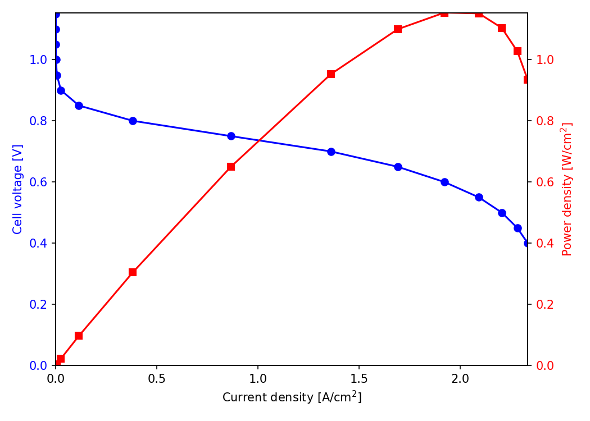
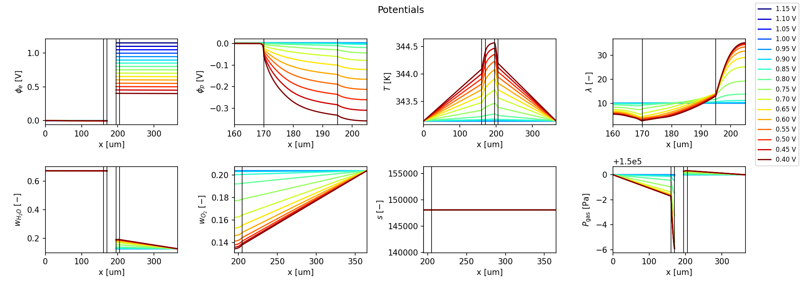
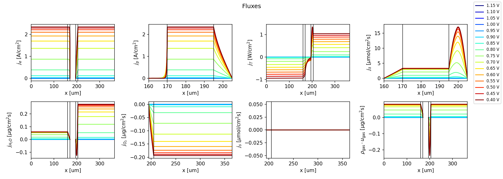

# 1D PEM Fuel Cell Model

A Python implementation of a one-dimensional, steady-state, non-isothermal,
two-phase, macro-homogeneous membrane electrode assembly (MEA) model for
polymer electrolyte membrane fuel cells.

Written by **Victor Constantin Cartsounis** as the codebase for a master's
thesis at **CEFET-MG**, supervised by **Sidney Nicodemos da Silva**.

The model resolves eight coupled quantities across the five MEA layers — anode
GDL, anode catalyst layer, membrane, cathode catalyst layer, cathode GDL — and
will be extended over the course of the thesis.

It also answers how far the solution moves when a material property changes:
the [forward sensitivity equations](#sensitivity-analysis) are solved for eight
material parameters, giving `∂y/∂θ` across the MEA for every quantity and every
flux.

## Physics reference

The governing equations, constitutive relations and parameter values
implemented here follow:

> R. Vetter, J. O. Schumacher, *Free open reference implementation of a
> two-phase PEM fuel cell model*, Computer Physics Communications **234**
> (2019) 223–234. <https://doi.org/10.1016/j.cpc.2018.07.023>

Cite that paper for the model formulation, and this repository for the
implementation and the extensions developed during the thesis.

The authors' MATLAB reference implementation, published alongside the paper,
was also consulted during development:
<https://github.com/Isomorph-Electrochemical-Cells/PEMFC-1DMMM>.

### License and attribution

This project is released under the **BSD-3-Clause** license (see `LICENSE`).
The reference implementation consulted during development is distributed under
the same license by the Institute of Computational Physics, ZHAW (© 2017–2020),
and their copyright notice is retained in `LICENSE` accordingly. Clause 3 of
that license also means their names must not be used to imply that they endorse
this work or its extensions.

## Model structure

Each of the eight quantities obeys a second-order transport equation, written
as a potential/flux pair — 16 first-order equations per layer, 80 in total.

| Quantity | Symbol | Active layers |
|---|---|---|
| Electron potential | `phi_e` | GDLs and CLs |
| Proton potential | `phi_p` | CLs and membrane |
| Temperature | `T` | all |
| Dissolved water content | `lambda` | CLs and membrane |
| Water vapour mass fraction | `w_H2O` | GDLs and CLs |
| Oxygen mass fraction | `w_O2` | cathode side |
| Liquid water pressure | `P_liq` | cathode side |
| Gas pressure | `P_gas` | GDLs and CLs |

## Example results

All three figures below come from one command — the full voltage sweep of the
[Running](#running) section — and are the same files any run writes into its
own `results/` directory.

The polarization curve is the model's headline output: cell voltage against
current density, with the power density on the right-hand axis. The activation
losses dominate near open circuit, the ohmic region is the near-linear middle,
and the curve bends over at high current where oxygen transport to the cathode
catalyst layer starts to limit the cell.



The eight quantities of the table above, plotted across the MEA. Each curve is
one cell voltage, dark blue (open circuit) through dark red (highest current),
and each panel spans only the layers where that quantity is defined. The
vertical lines mark the layer interfaces; anode is on the left, cathode on the
right.



The matching fluxes — the second half of each potential/flux pair. Electron and
proton current hand off inside the catalyst layers, which is what makes `j_e`
and `j_p` mirror each other there, and the flat sections elsewhere are simply
the layers where no source term acts.



## Solver design

Every layer carries its own equation set, coupled to its neighbours by
continuity conditions at the four internal interfaces.
`scipy.integrate.solve_bvp` requires a strictly increasing mesh and has no
notion of separate regions, so the five layers are **stacked** into a single
system of `5 × 16 = 80` first-order ODEs over one normalised coordinate
`s ∈ [0, 1]`, with a copy of `s` per layer. The chain rule maps it back onto
physical position:

```
x_region(s) = Lsum[region] + s * L[region]      =>      dY/ds = L[region] * dY/dx
```

Interface continuity and gas-channel conditions are then imposed as boundary
conditions on the stacked system, which is equivalent to solving the five
layers as a coupled multi-region problem. See `pemfc_1d/model.py`.

## Sensitivity analysis

How much does the answer depend on a material property that was measured once,
in a different cell, and quoted to two significant figures? The model solves
the **forward (direct) sensitivity equations** to say so.

Differentiating `Y' = F(x, Y; θ)` with respect to a parameter `θ` gives a
transport equation for the sensitivity `Z = ∂Y/∂θ`:

```
Z' = (∂F/∂Y)(x, Y; θ) · Z  +  ∂F/∂θ
```

`Z` is stacked onto the model and the pair — 160 first-order equations, 80 of
the model and 80 of its sensitivity — is handed to the same `solve_bvp`,
starting from the mesh and the solution the voltage sweep has already converged
on. The boundary conditions for `Z` are the model's own residuals
differentiated, which for this model is the same linear form with its constants
removed: every residual is affine in the state, and none of the eight
properties appears in one.

### The derivatives come from the model, not from a second copy of it

`∂F/∂Y` (80 × 80) and `∂F/∂θ` are **derived symbolically from the code that
already runs**. `pemfc_1d/symbolic.py` calls `full_ode` itself with sympy
symbols in place of the state and a numpy shim in place of `numpy`, so the
expressions it evaluates are recorded rather than computed, and sympy
differentiates those. Nothing about the physics is written a second time, so
the Jacobian cannot drift away from the model it belongs to — change a
constitutive relation in `params.py` and the sensitivity equations follow it.

### What θ is

Each parameter is a **dimensionless multiplier** on a material property, equal
to 1 at the nominal parameter set, rather than the property's own value:

| `θ` | Property | Scales |
|---|---|---|
| `sigma_e` | electrical conductivity | `sigma_e_GDL`, `sigma_e_CL` |
| `sigma_p` | protonic conductivity | `Params.sigma_p` |
| `k` | thermal conductivity | `k_GDL`, `k_CL`, `k_PEM` |
| `D_lambda` | dissolved-water diffusivity in the ionomer | `Params.D_lambda` |
| `eps_p_over_tau2` | pore/tortuosity factor `ε_p/τ²` | shared by every gas diffusivity |
| `D_H2` | hydrogen diffusivity (the anode H₂/H₂O binary pair) | `Params.D_H2O_A` |
| `D_O2` | oxygen diffusivity | `Params.D_O2` |
| `kappa` | absolute hydraulic permeability | `kappa_GDL`, `kappa_CL` |

A multiplier rather than the value itself because several of these are not
single numbers — "electrical conductivity" is a GDL value *and* a CL value, and
the pore/tortuosity factor is not a field at all but a factor inside a
constitutive relation. It also leaves `∂Y/∂θ` in the units of `Y` for every
parameter, so the eight figures are directly comparable: each reads as *how far
the solution moves if this property were 100% larger*.

### Validation

Every result is checked against a central difference of the unmodified model:
the sweep is re-solved at `θ = 1 ± ε` and `(Y(θ+ε) − Y(θ−ε)) / 2ε` compared with
`Z(x)`. `tests/test_sensitivity.py` does this for all eight parameters, and
checks `∂F/∂Y` and `∂F/∂θ` against differences of `full_ode` itself as well, so
a disagreement can be localised to a term rather than just observed.

### Running it

It runs as part of `python run_example.py`, writing one figure per parameter:

```
results/run_20260918_142233/
    sensitivity_sigma_e.png
    sensitivity_sigma_p.png
    ...
```

Each figure repeats the layout of the potentials and fluxes figures — eight
quantities above their eight fluxes, one colour per cell voltage, each panel
spanning only the layers where its quantity is defined — but plots `∂y/∂θ` and
`∂j/∂θ` instead of `y` and `j`.

The analysis is the expensive half of a run, so it has a switch.
`SENSITIVITY_ENABLED` at the top of `run_example.py` turns it off, and
`--no-sensitivity` does the same for one run; with it off the module is not
even imported, so neither sympy nor the symbolic differentiation is paid for.
`--sensitivity-parameters sigma_p D_O2` narrows it to the ones you care about.

From Python:

```python
from pemfc_1d import solve
from pemfc_1d.sensitivity import SENSITIVITY_PARAMETERS, solve_sensitivity
from pemfc_1d.postprocessing import plot_sensitivity_profiles

result = solve()
sensitivity = solve_sensitivity(result, "sigma_p")
print(sensitivity.current_sensitivities)      # dI/dtheta [A/cm^2] per voltage
figure = plot_sensitivity_profiles(sensitivity)
```

`pemfc_1d.sensitivity` is deliberately *not* re-exported from the `pemfc_1d`
namespace, for the same reason `pemfc_1d.postprocessing` is not: importing it
pulls in sympy, and a run that only wants current densities should not pay for
that.

## Layout

```
pemfc_1d/
├── state.py            # state-vector layout: Region / State / Quantity enums
├── params.py           # constants, operating conditions, constitutive relations
├── saturation.py       # capillary pressure -> liquid water saturation
├── model.py            # per-layer physics, boundary conditions, solve loop
├── symbolic.py         # symbolic trace of full_ode, and its derivatives
├── sensitivity.py      # forward sensitivity equations and the augmented solve
├── metrics.py          # run metrics, provenance and the on-disk log
└── postprocessing.py   # profile extraction and plots
tests/
├── data/
│   └── reference_solution.npz   # validated reference output (golden file)
├── test_smoke.py                # convergence and monotonicity
├── test_regression.py           # full solution pinned to the golden file
├── test_constitutive.py         # parameters, correlations, saturation inversion
├── test_metrics.py              # run metrics, provenance and the on-disk log
├── test_sensitivity.py          # sensitivities against central differences
└── test_public_api.py           # the surface the GUI repository consumes
docs/images/                     # example figures shown in this README
run_example.py                   # command-line entry point
```

Quantities and layers are addressed by name rather than by index: `State`,
`Region` and `Quantity` are `IntEnum`s, so `block[State.W_O2]` and
`residuals[Region.CCL, State.J_E]` index arrays directly while remaining
readable. `Params` is a frozen dataclass, so the physical constants of a
running model cannot be mutated by accident.

## Installation

```bash
poetry install
```

## Running

```bash
python run_example.py
```

This solves the default voltage sweep (1.15 to 1.00 V in 50 mV steps), prints
the current and power density at each voltage, and writes one timestamped run
directory under `results/`:

```
results/run_20260912_102554/
    potentials.png
    fluxes.png
    polarization_curve.png
    sensitivity_sigma_e.png       # one per material parameter
    ...
    metrics.log
```

Every run gets its own directory, so results are never overwritten and any
figure can be traced back to the settings that produced it.

For a full polarization curve including the mass-transport-limited region:

```bash
python run_example.py --no-show --voltages 1.15 1.10 1.05 1.00 0.95 0.90 0.85 \
    0.80 0.75 0.70 0.65 0.60 0.55 0.50 0.45 0.40
```

At low voltage the mesh grows quickly and `solve_bvp` may report that it could
not meet `--tol`, warning once per voltage. `--max-nodes` defaults to
`10000 // 80` = 125, the ceiling MATLAB's `bvp4c` imposes on a system of this
size (`NMax = floor(10000/n)`), so the port stops refining where the reference
implementation stops and carries on from the same solution. Raising it is
rarely the fix: where the adaptive mesh clusters around a feature the
collocation method cannot resolve, the solver exhausts memory before the error
estimate drops. Judge those points by the convergence check described below
rather than by the tolerance flag.

### The run log

`metrics.log` records the run's provenance (timestamp, git revision, exact
command, host, library versions), the solver settings, and two kinds of
measurement that are deliberately kept apart:

* **Cost and diagnostics** — elapsed time, node count per voltage, the largest
  `rms_residual`, and whether `solve_bvp` met its tolerance. These say how hard
  the solver worked, not whether the answer is right.
* **Verification** — the current density re-solved on a mesh `--refine-factor`
  times finer, and `|dI|/I` between the two. This is the number that certifies
  a run: it says how much refining the mesh changes the answer.

The distinction matters because the two can disagree. A solver can miss its
tolerance on a solution that is converged to several digits — a discontinuity
in a constitutive relation is enough to hold the local residual up no matter
how fine the mesh gets — and can equally meet it on a mesh too coarse for the
answer to have settled. So the tolerance column is read as a diagnostic, and
the refinement comparison is what certifies a point.

The refined solve roughly triples the runtime; pass `--no-convergence-check` to
skip it. It is capped so that requesting a check can never be what exhausts
memory.

Not measured: agreement with experimental data. That is a separate question
from numerical convergence, and it is the one that decides whether a change to
the physics is an improvement.

From Python:

```python
from pemfc_1d import solve
from pemfc_1d.postprocessing import plot_potentials_and_fluxes, plot_polarization_curve

result = solve()                      # default sweep
print(result.voltages)                # [V]
print(result.current_densities)       # [A/cm^2]
print(result.power_densities)         # [W/cm^2]
assert result.converged

fig_potentials, fig_fluxes = plot_potentials_and_fluxes(result)
fig_polarization = plot_polarization_curve(result)
```

A sweep is run by continuation — each voltage starts from the previous
converged solution — so voltages should be ordered from high (low current)
downwards.

## Graphical interface

A PySide6 desktop front end — configure a run, see what governs each layer of
the cell, and read the figures back in the window — lives in its own
repository:

**https://github.com/victorcartsounis/1D-PEMFC-Model-GUI**

It depends on this package and not the other way round: nothing here imports
it, the solver and the test suite need neither Qt nor the interface installed,
and an interface bug cannot change a number this model produces. The names it
is entitled to import are the ones `pemfc_1d` exports, listed in that
package's docstring and pinned by `tests/test_public_api.py`.

## Tests

```bash
python -m pytest tests/
```

`tests/data/reference_solution.npz` is a golden file holding validated output:
current densities, spatial profiles, ODE right-hand sides, boundary-condition
residuals, every parameter value and the saturation inversion. The suite pins
the model to it, so a refactor that perturbs the numbers fails loudly.

**Regenerate the golden file only when the physics is deliberately changed** —
never to make a failing refactor pass.

Some two-phase behaviour is intentionally inactive in this version; the tests
pin it so it cannot change unnoticed.

## Performance and convergence

* The default sweep (1.15–1.00 V, 4 points) solves in about 3 seconds.
* The sensitivity analysis adds one 160-equation solve per parameter and per
  voltage, which dominates a run; `--no-sensitivity` or
  `--sensitivity-parameters` keeps it short. Its collocation Jacobian holds
  four times the non-zeros of the model's own, so budget roughly four times the
  memory per mesh node.
* Tested down to 0.40 V (~2.3 A/cm², in the mass-transport-limited plateau);
  the full 1.15–0.40 V sweep takes a couple of minutes, as the adaptive mesh
  grows considerably at low voltage.
* If `solve_bvp` fails to converge, increase `n_per_region` or `max_nodes`,
  narrow the voltage step for smoother continuation, or relax `tol`.

## VS Code integration

The `.vscode/` folder ships ready-to-use configuration:

* **`launch.json`** — run the default sweep, run the full polarization curve,
  debug the open file, or debug the test suite. Breakpoints work in
  `pemfc_1d/model.py` as usual; open the Run and Debug panel (`Ctrl+Shift+D`).
* **`tasks.json`** — shell tasks (`Ctrl+Shift+P` → *Tasks: Run Task*) for
  `poetry install`, running the tests, and running the default sweep.
* **`settings.json`** — enables the Testing panel with pytest auto-discovery.
* **`extensions.json`** — recommends Python, Pylance, debugpy, Even Better TOML
  and Jupyter.

## Credits

Implementation, extensions and subsequent development: **Victor Constantin
Cartsounis**, CEFET-MG, 2026.

Model formulation and constitutive relations: R. Vetter and J. O. Schumacher,
Institute of Computational Physics, ZHAW — see
[Physics reference](#physics-reference).
